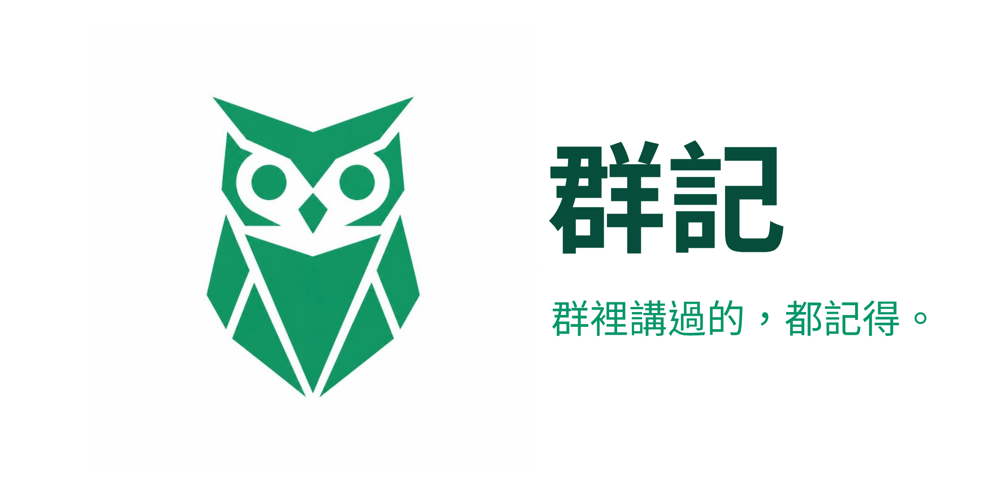
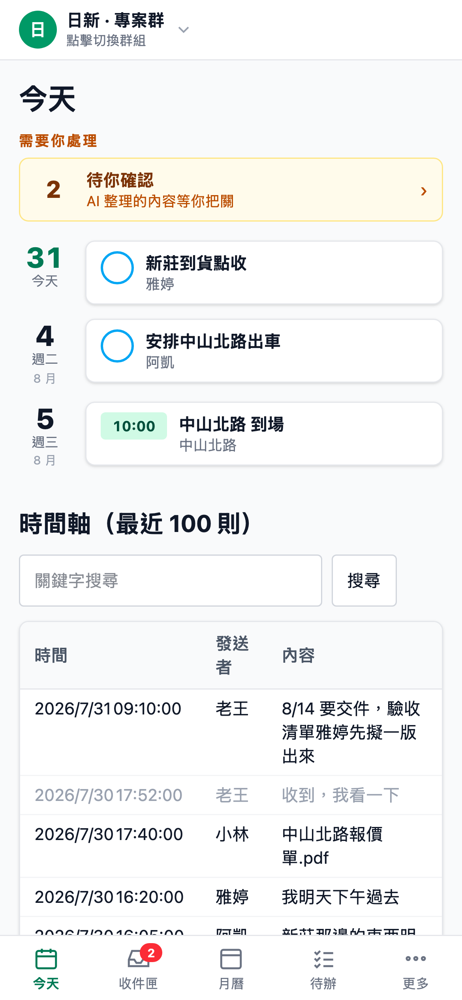
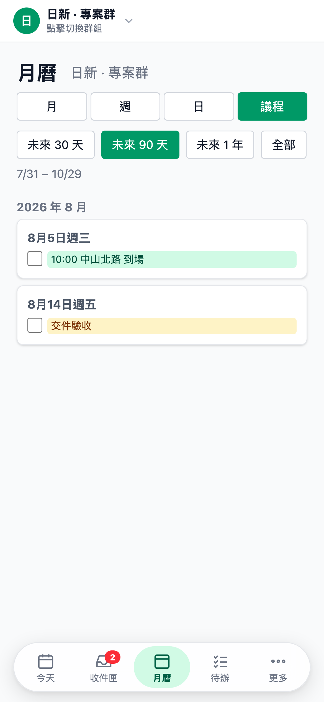
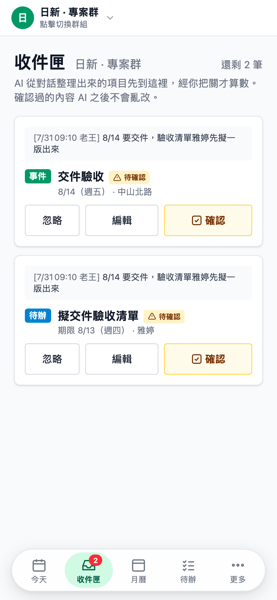
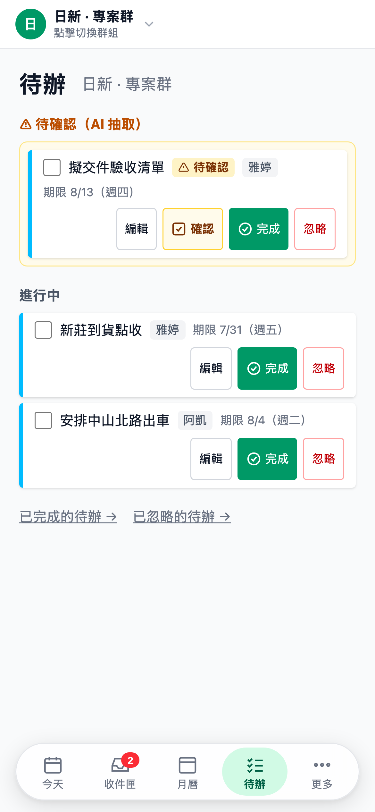
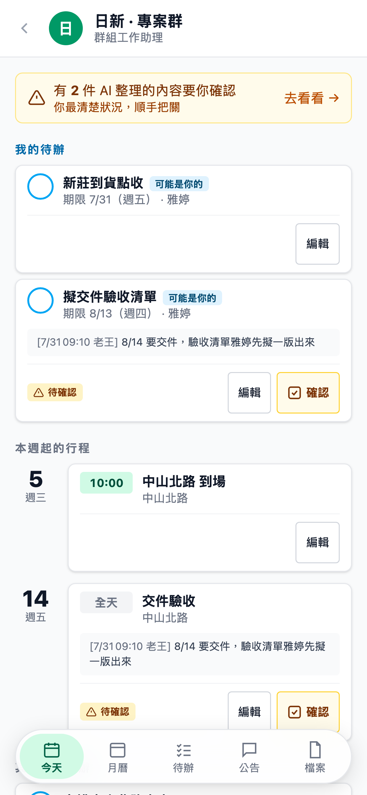

# GroupScribe — 群組工作助理「群記」

<p align="center"></p>

**你的團隊已經在 LINE 群組裡把事情講完了。它負責記住。**

誰負責什麼、幾號要交、老闆拍板的規則、上週傳的那張估價單——全都講過，然後沉到訊息海裡。
GroupScribe 是一個安靜待在群組裡的 bot：不打擾、不聊天，把對話整理成行程、待辦與公告，
你在手機上隨時看得到，而且每一筆都能點回原始的那句話。

**沒有新的輸入習慣要養成。你照常在群組講話，其餘自動發生。**

> A group-chat knowledge engine for teams that run on LINE. It silently indexes work conversations
> (text / images / PDFs / voice), extracts events, tasks and decisions, and answers @-mentions with
> cited sources. Self-host it (AGPL-3.0) or let us host it for you.

<p align="center">
  
</p>

<p align="center">
  <sub>上方第一列「新莊到貨點收／雅婷」是自動生成的——連負責人都是 AI 從下方時間軸<br>
  雅婷那句「我明天下午過去」推出來的。沒有人手動輸入過任何一個欄位。</sub>
</p>

---

## 它怎麼運作

**1. 把 bot 加進你的 LINE 工作群**
進群時發一次隱私告知，之後就沉默。它不會回話、不會刷版、不會通知全群。

**2. AI 在背景整理**
「下週三早上八點到現場」變成月曆上的行程；「@小林 這份資料你先看一下」變成有負責人的待辦；
「以後估價單一律副本給會計」變成公告。傳進群的圖片與 PDF 會做 OCR 與摘要——
報價單裡的金額、規格表上的數字，之後都搜得到。

<p align="center">
  
</p>

**3. 你把關，它才算數**
AI 只提供線索。所有抽取結果先進「收件匣」，附上它是根據哪句話整理的，
你確認過才算定案。改錯了？直接編輯。整個是假的？一鍵忽略，而且它不會再犯同樣的錯。

<p align="center">
  
  
</p>

<p align="center">
  <sub>「確認」（核可 AI 的判斷）與「完成」（這件事做完了）是兩件事，<br>
  所以它們的顏色與形狀都不一樣——琥珀方章 vs 綠色圓圈。</sub>
</p>

**4. 現場的人也看得到**
員工在 LINE 裡點一下就能看自己群組的行程、待辦與檔案——不必另外裝 app、不必註冊帳號。
他們只看得到自己所屬群組的內容。

<p align="center">
  
</p>

<p align="center">
  <sub>成員看到的是同一批資料的另一種樣子——「我的待辦」在最上面，<br>
  待確認的項目附上原始對話，讓最清楚狀況的人順手把關。</sub>
</p>

**5. 忘記的時候問它**
在群組 `@bot 上次那個報價多少`，它會回答並告訴你是誰、哪天說的。查不到就直說查不到。

---

## 為什麼你可以信任它

把公司群組交給一個 bot 是很大的一步。這些是設計時就決定的事，不是事後補的政策：

| | |
|---|---|
| **程式碼全部公開** | 你可以自己檢查它到底讀了什麼、傳去哪裡。這是 AGPL 的意義——任何人拿去改都必須繼續公開 |
| **沉默式設計** | 進群告知後不再主動說話。唯一開口的時機是被 @ |
| **資料是你的** | 自架時，訊息存在你自己的 Supabase 專案；要更徹底可換成自己的 Postgres 與本地 LLM |
| **成員只看自己的群** | 權限以 LINE 群成員 API 為準，退群的人立刻失去存取權 |
| **尊重收回** | 在 LINE 收回的訊息，連同向量與媒體原檔一併刪除 |
| **一鍵刪除** | 群組資料可以整包刪掉，不留殘影 |
| **低資訊不留存分析** | 貼圖、「好」、「收到」只留原始紀錄，不進 AI、不進向量 |

---

## 兩種使用方式

### 自己架（免費，AGPL-3.0）

適合有技術能力、想完全掌握資料的團隊。你需要一台 always-on 的機器、一個 Supabase 專案、
一組 LINE Messaging API channel 與一把 Gemini API key。**AI 成本極低**——實際運轉一個月
（約一萬則訊息、數十個檔案解析）的 Gemini 花費不到 US$0.05。

完整步驟見下方「快速開始」。

### 我來架（託管服務）

不想碰 Docker、不想管憑證與備份，就把這些交給我。你只需要把 bot 加進群組。

目前是 **Beta 階段，正在找幾家願意一起把它磨好的團隊**。
如果你的團隊用 LINE 群組在跑工作——不分行業，有群組工作流就算——
歡迎開一個 [Issue](../../issues) 或來信聊聊。

<0rigin.d.1865@gmail.com>

---

## 快速開始（自架）

1. **Supabase**：建立專案 → SQL Editor 執行 [supabase/schema.sql](supabase/schema.sql)
2. **LINE Developers Console**：建立 Messaging API channel
   - 開啟「允許加入群組聊天」（預設關閉）、關閉自動回應訊息
   - 記下 Channel secret 與 Channel access token
   - ⚠️ 未來換帳號時，新 channel 務必開在**同一個 Provider** 底下，否則 userId 全變
3. **Gemini**：取得 API key
4. `cp .env.example .env.local` 並填入金鑰
5. `npm install && npm run dev`
6. Webhook URL 設為 `https://<你的網域>/api/webhook/line`（本機用 ngrok 或 cloudflared 建通道）
7. 邀 bot 進群 → 它發一次告知訊息後開始沉默記錄
8. 管理後台：`http://localhost:3000`（密碼為 `ADMIN_PASSWORD`）

**想先看看長什麼樣子？** 不必接 LINE，跑一份示範資料就有完整畫面：

```bash
npx tsx scripts/seed-demo.ts     # 建立示範群組（假公司、假對話）
npx tsx scripts/seed-demo.ts --drop   # 用完清除
```

<details>
<summary>本機開發通道（ngrok runbook）</summary>

1. `ngrok http 3000` → 取得 `https://xxxx.ngrok-free.dev`（免費版**每次重開網址會變**）
2. LINE Developers Console → Messaging API → **Webhook URL** 填 `https://xxxx.ngrok-free.dev/api/webhook/line` → 按 Verify
3. 兩個開關都要開：Developers Console 的「Use webhook」＋ Official Account Manager（manager.line.biz）回應設定的「Webhook」
</details>

---

## 部署

**這個 app 需要長跑環境**——webhook 回 200 後才在背景跑 LLM 抽取（數秒到數十秒），
匯入與回補抽取可能跑數分鐘（`maxDuration = 300`）。另外抽取的並發鎖是 in-memory 的，
**單一長跑實例是它成立的前提**。

<details>
<summary>自架機器 ＋ Tailscale Funnel（本專案採用）</summary>

任何 always-on 的 Linux 機器（VPS / NAS / 自己的伺服器）跑 Docker，
用 Tailscale Funnel 取得固定 HTTPS 網址，**不用買網域、不用管憑證**。

```bash
docker build -t groupscribe .
docker run -d --name groupscribe --restart always -p 3000:3000 --env-file .env.local groupscribe
tailscale funnel --bg 3000        # → https://<機器名>.<tailnet>.ts.net
```

Webhook URL 設為 `https://<機器名>.<tailnet>.ts.net/api/webhook/line`。
`--restart always` 確保開機自啟＋崩潰自動重啟（webhook 漏訊息不可回補，可用性很重要）。
</details>

<details>
<summary>Fly.io（約 US$3/月）</summary>

```bash
brew install flyctl
fly auth signup && fly apps create groupscribe
fly secrets set LINE_CHANNEL_SECRET=... LINE_CHANNEL_ACCESS_TOKEN=... \
  SUPABASE_URL=... SUPABASE_SERVICE_ROLE_KEY=... GEMINI_API_KEY=... ADMIN_PASSWORD=...
fly deploy
fly status               # 確認只有 1 台 machine、state=started
```
</details>

<details>
<summary>傳統 HTTPS ／ Serverless 的注意事項</summary>

- **傳統 HTTPS**：`npm run build && npm start`＋設 `TZ=Asia/Taipei`；用 Caddy 自動憑證（需自有網域）。
  想要**資料完全不經第三方**，這條路才走得完整：把 Supabase 換成自己的 Postgres+pgvector、
  把 Gemini 換成本地 LLM/embedding（見「架構」的抽換方式）。
- **Serverless（Vercel 等）**：需先解兩件事——函式執行時限是否容得下上述 workload；
  以及多實例會讓 in-memory 並發鎖失效（需改為 DB 層鎖，如 Postgres advisory lock）。
</details>

---

## 架構

核心引擎平台無關，外部依賴全部是可抽換插件：

```
src/
  core/        平台無關核心：ingest（過濾/落地）→ indexer（切塊/向量）
               → extract（結構化抽取）→ query（時間加權檢索/問答）
    types.ts   四個 Provider 介面——核心只認介面，不認廠商
  connectors/  訊息來源插件（line.ts；未來 telegram.ts、discord.ts…）
  providers/   AI 服務插件（gemini.ts；未來 claude.ts、ollama.ts…）
  app/         Next.js：webhook、管理後台、LIFF 成員版
```

抽換方式：實作 `src/core/types.ts` 的介面 → 在 `src/core/config.ts` 對應表加一行 →
改環境變數（如 `LLM_PROVIDER=ollama`）。金鑰一律走環境變數，絕不進程式碼與 DB。

**設計原則**見 [docs/principles.md](docs/principles.md)——這個產品的第一性原理是「訊號與噪音」，
以及由它推出的三條規則（假陽性比假陰性貴、噪音分三層、已處置的東西不佔主畫面）。
每個 UI 決策都對得回那份文件。開發進度與延後項的觸發條件見 [docs/plan.md](docs/plan.md)。

<details>
<summary>管理端點</summary>

| 端點 | 用途 |
|---|---|
| `POST /api/process` | 重跑卡在 pending 的媒體解析＋回補群組名稱/頭貼 |
| `POST /api/reindex` | 換 embedding 模型後全量重建向量 |
| `POST /api/extract` | 手動/回補抽取（form 參數 `group_id`，省略＝全部群組） |
| `POST /api/digest` | 每日摘要推播（給 cron 打，`?key=ADMIN_PASSWORD`） |
</details>

---

## 介面架構

一個殼、一份路由表、兩個工作區。

```
/o/[slug]/          layout.tsx      唯一權限閘門（visibleModules → notFound）
                    routes.tsx      全站唯一路由表：MODULES = [群組助理, 考勤]
                    shell-header    工作區切換器 + nav + context 切換器
   ├── (admin)/     群組助理：今天/收件匣/月曆/待辦 + 更多(公告/檔案/群組/匯入/設定)
   └── attend/      考勤：總覽/員工/審核/報表 + 更多(地點/規則)
/g                  LINE 成員版（群組成員都看得到）
/a                  員工打卡（頂部三 pill：打卡/月曆/我的申請）
```

- **加一頁＝在 `routes.tsx` 加一行** —— TopNav、底部膠囊、`/more` 頁、active 判定全部由此推導
- **工作區切換器只在有兩個模組時渲染**：只有考勤權限的 org 管理員，畫面上不存在「另一個工作區」
- **context 參數跟著換頁走**：群組助理帶 `?group=`、考勤帶 `?emp=`（用 URL 不用 cookie —— 可分享、狀態看得見）
- **共用元件在 `src/app/ui/`**：Banner / Badge / MonthGrid / Empty / StatGrid / PageHeader，
  以及狀態語意色 `tone.ts`（ok/warn/err/neutral 四個，跨模組不衝突）
- **視覺尺度採 [Origin UI](https://github.com/origin-space/originui)（shadcn 慣例）**：圓角基準 10px、控制項高 36px、
  3px 淡色焦點環、徽章膠囊、字重 medium——全部收在 `globals.css` 的 `@theme` 與 `@layer components`，改一處全站跟著變。
  元件命名與行為對照 [Component Gallery](https://component.gallery/components/)：

  | 本專案 | Component Gallery 名（別名） | 行為約定 |
  |---|---|---|
  | `.btn` / `.btn-primary` / `.btn-danger` / `.btn-confirm`、`.btn-sm` | Button | 送出後轉圈並鎖住（root layout 3 行 JS）；focus-visible 才顯示焦點環 |
  | `Banner` / `Flash` | Alert（Banner, Notification, Callout） | ok/neutral 為 `role=status`、warn/err 為 `role=alert` |
  | `Badge` / `OutlineBadge` / `PendingBadge` | Badge（Tag, Label, Chip） | 非互動；身分用描邊、狀態用淡底 |
  | `Empty` | Empty state | 主文＋副文＋一顆下一步；篩不到（filtered）不給引導 |
  | `StatGrid` | Card（stat） | 待處理類 hideZero；量測類永遠顯示 |
  | `.segmented`（月曆視圖／議程範圍） | Segmented control（Toggle button group） | `aria-current=page` 標選中，MPA 連結 |
  | `SurfaceSwitcher` | Segmented control | 少於兩個面向整條不渲染 |
  | `FloatingNav` / BottomNav | Navigation（Tabs） | 五格、badge、拖曳與整頁滑動換頁 |
  | `GroupSwitcher` / `EmployeeSwitcher` | Select | 切換時只保留 view 參數、丟棄 entity 參數 |
  | `BatchBar` ＋ `BatchBox` | Toolbar（Button group）＋ Checkbox | 勾選後才浮出；全選在列內 |
  | `Loading` / `.spinner` | Spinner（Loader） | `role=status`；表單送出時按鈕內縮小版 |
  | `PageHeader` | Header ＋ Link（返回） | 返回是硬編碼路徑，不用 history.back |
- **三支守門測試**把紀律變成 CI：`routes`（連結必帶 org 前綴）、`colors`（深色 remap 齊全、
  indigo/teal 不復活）、`i18n`（五語系 key 一致、參數不漏）

---

## 考勤模組（多租戶打卡與薪資）

取代原 Attendance-System（GAS + Google Sheets）的重寫版，併入本專案共用 LINE 身分與部署。

- **員工端（LIFF `/a`）**：GPS 打卡（伺服端驗地點半徑）、月曆紀錄、補卡申請；五語系（中/英/日/越/印尼）
- **管理端（`/o/[slug]/attend`）**：總覽異常、員工管理（啟用/月薪/部門/管理權/加入碼）、
  打卡地點、補卡審核、月曆與薪資明細、CSV 月報匯出
- **薪資引擎兩層**：結構化規則（台灣勞基法預設：平日 4/3→5/3、休息日 4/3→5/3→8/3、
  例假日、國定假日、休息時段扣除）＋ 沙箱化自訂腳本（quickjs-emscripten，記憶體/時間上限，
  失敗回退規則並顯示錯誤）。規則版本 append-only；月結快照凍結金額，改規則不影響已結算月份
- **與舊系統的刻意差異**：補卡核准才落地成打卡紀錄（舊制待審卡混入工時）；週末正確按
  休息日/例假日計算（舊制 dayType 缺陷使週末被算成平日，**修正後加班費會比舊系統高**）；
  GPS 可被瀏覽器偽造是已知天花板，擋誤按不擋有心人

**新客戶怎麼開始（形態 A：共用一個 GroupScribe 官方帳號；全程自助，平台擁有者不必介入）**

1. 客戶到 `/start` 用 LINE 登入、輸入組織名稱 → 免費方案（1 個群）立即建好，自己就是 owner
   （平台擁有者要代建可用 `npx tsx scripts/new-org.ts <slug> <名稱> <管理員 LINE userId> [gs|attend|gs,attend]`）
2. 客戶把 GroupScribe 官方帳號**邀進**他們的 LINE 工作群（是邀進群，不是加好友）。
   ⚠️ LINE 一個群只能有一個官方帳號：群裡已有其他 bot 時，群記進群後會在 1 秒內被 LINE 移出
   （伺服器 log 會看到 `LINE 回覆失敗 400 Failed to send messages`），要先移出舊 bot
3. bot 回一則「請管理員認領」＋連結；認領前不記錄任何訊息、不抽取、不索引，7 天沒人認領自動退群
4. 客戶管理員點連結 → LINE 登入 → 按「認領這個群」→ 從那一刻開始記錄（先認領者得）
5. 管理員之後從 `/login`「用 LINE 登入」進後台；考勤模組再到員工管理頁產加入碼
6. 方案上限（`org_settings.max_groups`，free＝1 群）：認領第 2 個群會導到 `/o/<slug>/upgrade`。
   線上付款（PAYUNi）尚未串接，升級目前由平台擁有者手動改 `org_settings.plan / max_groups / paid_until`

每家組織每月有 AI 呼叫上限（`org_settings.monthly_ai_calls`，free 1,500／starter 6,000／team 20,000，null＝不限）：
用完後訊息照存、暫停整理，方案頁與今天頁會顯示；用量記在 `org_usage`（migration 018）。
服務條款與隱私權政策在 `/terms`、`/privacy`（草稿，收費前請律師審閱）。

平台擁有者的總控台在 `/platform`（身分選單裡的「平台管理」）：所有公司的方案、群組數、管理員、本月 AI 用量，可直接改方案；未認領的群也列在這裡。
平台擁有者也可在 `/o/unclaimed/groups`（或任一 org 的群組頁）用「移轉」下拉手動歸戶。
認領連結需要公開網址：`.env.local` 設 `APP_BASE_URL=https://<你的網域>`。
台灣假日初始資料：`npx tsx scripts/seed-holidays.ts <org-slug>`（資料請對照人事行政總處公告核對）。

新增環境變數：`LINE_LOGIN_CHANNEL_SECRET`（Login channel 的 secret，管理員 LINE Login 用）。

---

## 目前的限制（誠實揭露）

- ~~單一組織~~ → 已多租戶化（orgs 層，`/o/[slug]/...`）；群組助理已開放給 org 管理員（`org_settings.modules` 含 `gs`），API 與跨群頁面一律綁本 org 群組（`gsAccess`＋守門測試），但**尚未在第二個真實租戶上驗證**
- **驗證規模有限**：目前在一個真實群組（約一萬則訊息）長期運轉，尚未在多群組環境大量驗證
- **txt 匯入無法去重**（LINE 匯出檔沒有訊息 ID），重匯前先刪除該群組資料
- **匯入的歷史訊息只抽取近 30 天**——更早的只進索引供問答，不會變成今天的待辦
- **語音轉寫剛上線**，尚未在大量真實語音上驗證
- **AI 會出錯**，所以才有收件匣把關流程。抽取品質仍在持續調校

---

## 授權

[AGPL-3.0](LICENSE)。**公司內部自架不受影響**——你可以自由使用、修改，不必公開任何東西。
AGPL 限制的是「拿去改一改變成閉源 SaaS 對外營利」這件事。保留未來雙授權的可能。
